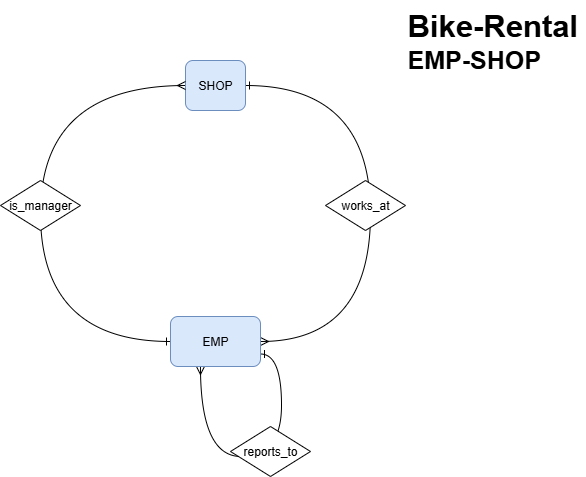
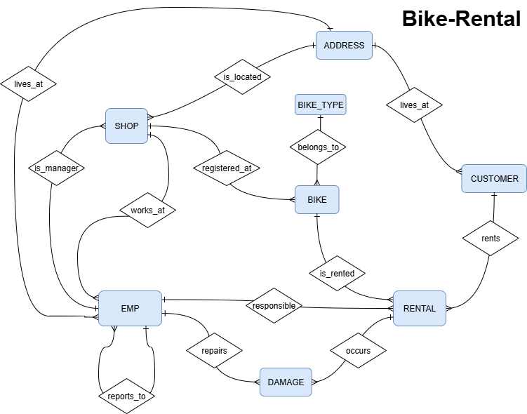

# db_bike_rental
This project realises the following relational database scenario: 
- bike-shops (shop) and employees (emp)
- bikes (bike) of several bike-types (bike_type) assigned to bike-shops
- customers (customer) rent bikes (rental)
- damages (damage) can happen during bike-rentals
- shops, customers, employees have addresses (address)
  
There is a small subset-scenario using the tables EMP and SHOP only.

### Creating DB-Schema and Loading Data
To create the schema and load some data, execute the following SQL-scripts.
SQL-files are located here:
* [create tables](https://kgdeck.github.io/db_exercises/data/create_tables_all.sql)
* [insert data](https://kgdeck.github.io/db_exercises/data/insert_all.sql)

Supported Databases: Oracle, Postgres

### ERD - Bike Rental 

  

  

