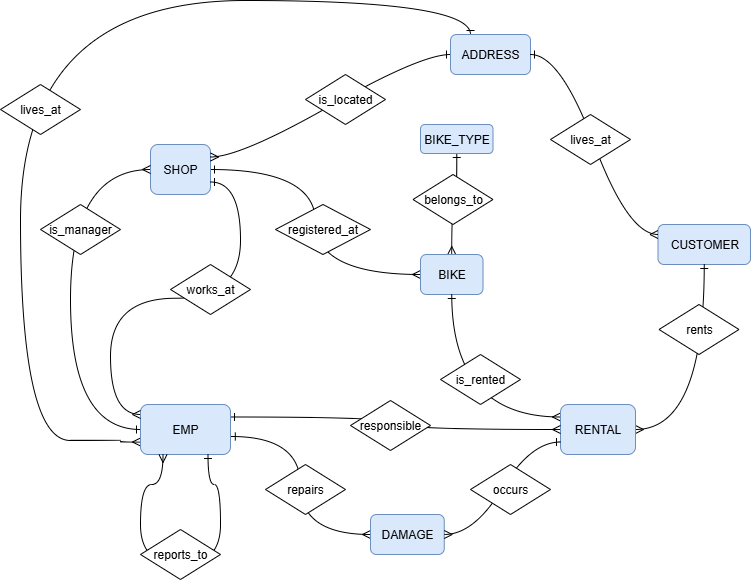

# db_bike_rental
This project realises the following relational database scenario: 
- bike-shops (shop) and employees (emp)
- bikes (bike) of several bike-types (bike_type) assigned to bike-shops
- customers (customer) rent bikes (rental)
- damages (damage) can happen during bike-rentals
- shops, customers, employees have addresses (address)

There is a small subset-scenario using the tables EMP and SHOP only.

![ERD Diagram - Emp/Shop-Scenario] (figures/erd01_small.drawio.png)

  

Hier gehts weiter

  

